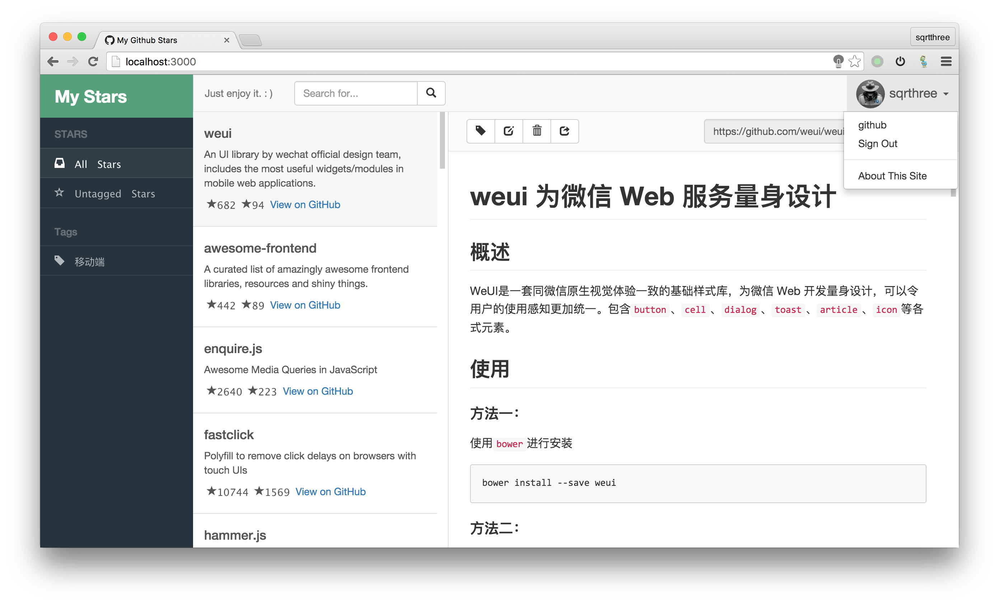
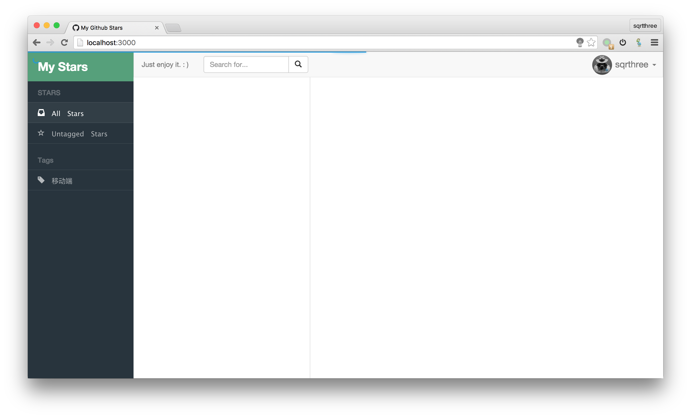
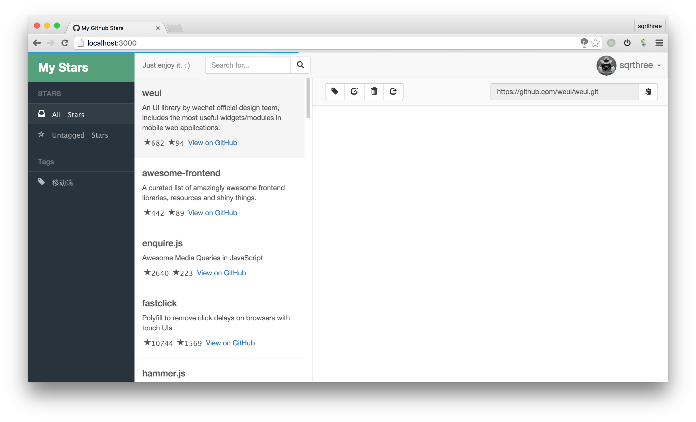
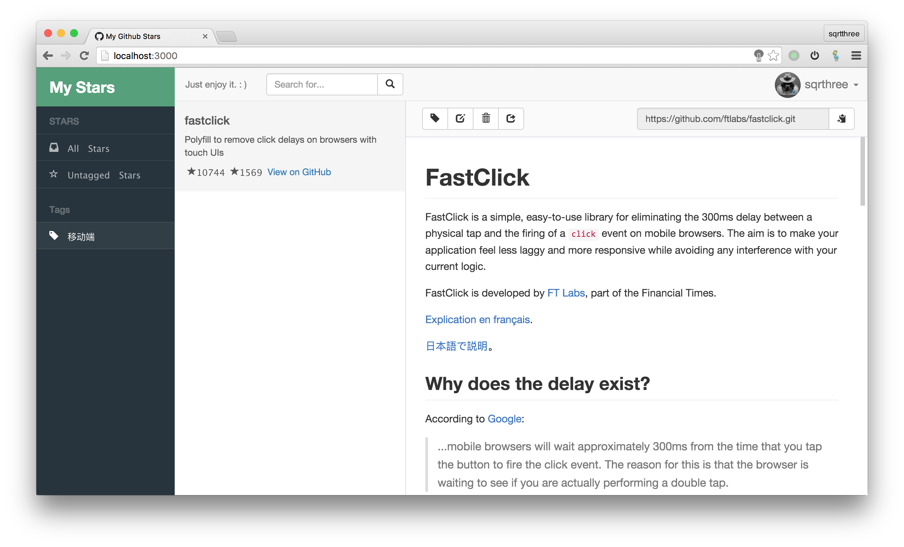
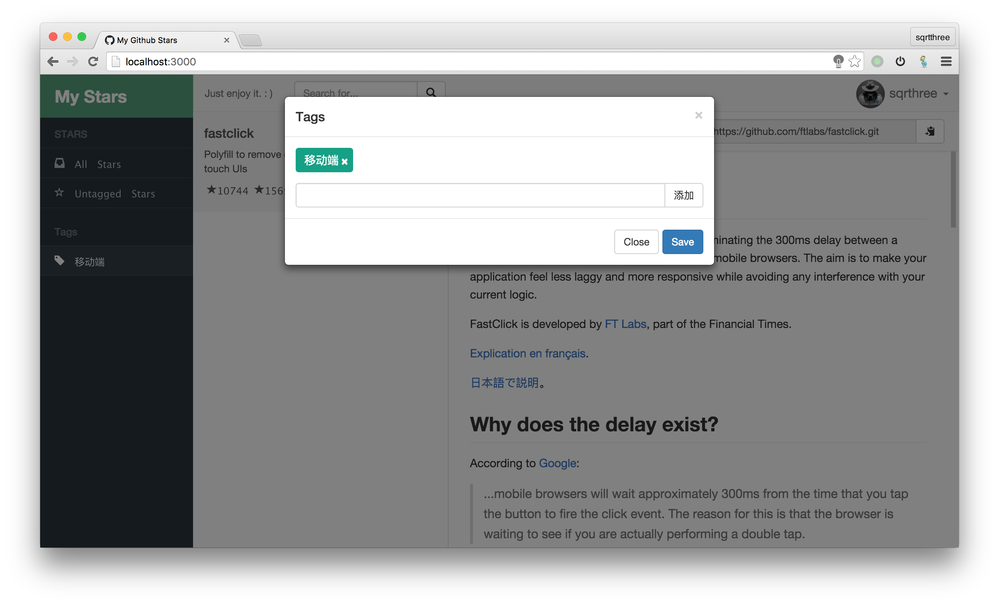

# My-GitHub-Stars

> 当你的 `github stars` 数目多达几十乃至几百个的时候, 你还能快捷优雅的查找项目么？

该项目可简单的管理你的 github stars 数据. 目前提供分类、备注和查询操作. 后续会继续更新和维护.

- [x] 获取 github 的 stars 和 repo 数据.
- [x] 备注和查询操作
- [x] 标签管理
- [x] 直接复制项目地址到系统剪贴板
- [ ] 备注支持 markdown 语法
- [ ] 可直接unstar 项目
- [ ] 分享项目
- [ ] github 账号未读消息数

效果预览:

#### 0. 环境依赖
该项目依赖 [node](https://nodejs.org/)、[npm](https://www.npmjs.com/)、[bower](https://github.com/bower/bower)、[mongodb](https://www.mongodb.org/) 环境,  并请确保 `mongodb`环境处于开启状态.

#### 1. 安装依赖
1. `Clone` 项目到本地.
2. 在项目根目录执行 `npm install` 命令安装 node 依赖.
3. 在项目根目录执行 `bower install` 命令安装前端依赖的框架.

#### 2. 修改配置文件
1. 访问 [https://github.com/settings/developers](https://github.com/settings/developers)注册一个 APP , 其中 `Authorization callback URL` 项填写为 `http://localhost:1338/`. 申请成功后能在该页面得到 `Client ID` 和 `Client Secret`.
2. 进入 `config` 文件夹, 并将 `development-example.json` 复制另存为 `development.json` 文件.
3. 修改刚刚新创建的 `development.json` 中的配置数据, 将第一步中申请到的 `Client ID` 和 `Client Secret` 填写到对应的位置.

#### 3. 启动服务.
1. 在项目根目录执行 `npm start` 命令.
2. 打开浏览器, 访问 `http://localhost:1338/` 即可.

#### 4. 关于`config/`文件夹下的文件说明
* `*-example.json` 文件为示例配置文件, 程序运行时不读取这个文件. 因此需要你手动创建一个同名但不包含 `-example` 字段的文件.
* `development-example.json`文件是开发环境示例配置文件(默认), `production-example.json` 为生产环境的示例配置文件.
* 一般如果把服务架设在本机, 只需要保证 `development.json` 文件即可.

#### 5. 运行方式
* 推荐使用本机环境运行.
* 后台运行该项目可使用 [pm2](https://github.com/Unitech/pm2) 进行进程监管.
* 推荐使用 [nginx](http://nginx.org/en/download.html) 绑定域名进行本地反向代理.
